# Social Support Portal - Complete Application Flow Diagram

## Overview
This diagram represents the complete application flow of the Social Support Portal, a government-level social assistance application with AI integration, internationalization, and accessibility features.

## Key Features
- ✅ Multi-step form wizard with validation
- ✅ AI-powered writing assistance 
- ✅ Real-time form validation with Zod schemas
- ✅ Internationalization (English/Arabic) with RTL support
- ✅ Auto-save functionality
- ✅ Progressive disclosure and conditional fields
- ✅ Comprehensive error handling
- ✅ Accessibility compliance
- ✅ Theme switching (Light/Dark)
- ✅ Mock service worker for API simulation

---

## Complete Application Flow Diagram

```mermaid
graph TD
    A[User visits application] --> B[main.tsx Entry Point]
    
    B --> C[Initialize Services]
    C --> C1[Initialize i18n]
    C --> C2[Start Mock Service Worker]
    C1 --> D[App.tsx]
    C2 --> D
    
    D --> E[Context Providers Setup]
    E --> E1[ThemeProvider - Light/Dark + RTL/LTR]
    E --> E2[ToastProvider - Notifications]
    E --> E3[I18nextProvider - Internationalization]
    E --> E4[ErrorBoundary - Global error handling]
    
    E1 --> F[AppLayout Template]
    E2 --> F
    E3 --> F
    E4 --> F
    
    F --> G[Router Setup]
    G --> H{Route Decision}
    
    H -->|"/"| I[HomePage]
    H -->|"/wizard"| J[WizardPage]
    H -->|"/components"| K[ComponentsPage]
    H -->|"*"| L[ErrorPage - 404]
    
    %% HomePage Flow
    I --> I1[Display Hero Section]
    I --> I2[Show Feature Grid]
    I --> I3[CTA to Start Application]
    I3 --> M[Navigate to /wizard]
    
    %% Main Form Wizard Flow
    J --> N[FormWizard Component]
    M --> N
    
    N --> O[FormWizardProvider Context]
    O --> O1[Load from localStorage]
    O --> O2[Initialize form state]
    O --> O3[Setup auto-save]
    
    O1 --> P[FormWizard Main Component]
    O2 --> P
    O3 --> P
    
    P --> Q[Current Step Determination]
    Q --> Q1{currentStep === 1?}
    Q --> Q2{currentStep === 2?}
    Q --> Q3{currentStep === 3?}
    
    %% Step 1 Flow - Personal Information
    Q1 -->|Yes| R[FormStep1 - Personal Information]
    R --> R1[Personal Identity Section]
    R --> R2[Contact Information Section]
    R --> R3[Address Information Section]
    
    R1 --> R1A[Full Name - ValidatedFormField]
    R1 --> R1B[National ID - ValidatedFormField]
    R1 --> R1C[Date of Birth - ValidatedFormField]
    R1 --> R1D[Gender Selection - ValidatedFormField]
    
    R2 --> R2A[Email Address - ValidatedFormField]
    R2 --> R2B[Phone Number - ValidatedFormField]
    
    R3 --> R3A[Street Address - ValidatedFormField]
    R3 --> R3B[City - ValidatedFormField]
    R3 --> R3C[State/Emirate - ValidatedFormField]
    R3 --> R3D[Country Selection - ValidatedFormField]
    R3 --> R3E[Postal Code - Conditional Field]
    
    %% Step 2 Flow - Financial Information
    Q2 -->|Yes| S[FormStep2 - Financial Information]
    S --> S1[Family Information Section]
    S --> S2[Employment Information Section]
    S --> S3[Housing Information Section]
    S --> S4[Benefits Information Section]
    
    S1 --> S1A[Marital Status - ValidatedFormField]
    S1 --> S1B[Number of Dependents - ValidatedFormField]
    
    S2 --> S2A[Employment Status - ValidatedFormField]
    S2 --> S2B[Occupation - Conditional Field]
    S2 --> S2C[Employer - Conditional Field]
    S2 --> S2D[Monthly Income - ValidatedFormField]
    S2 --> S2E[Monthly Expenses - ValidatedFormField]
    S2 --> S2F[Total Savings - ValidatedFormField]
    S2 --> S2G[Total Debt - ValidatedFormField]
    
    S3 --> S3A[Housing Status - ValidatedFormField]
    S3 --> S3B[Monthly Rent - Conditional Field]
    
    S4 --> S4A[Receiving Benefits - ValidatedFormField]
    S4 --> S4B[Benefit Types - Conditional Field]
    S4 --> S4C[Previously Applied - ValidatedFormField]
    
    %% Step 3 Flow - Descriptive Information
    Q3 -->|Yes| T[FormStep3 - Descriptive Information]
    T --> T1[Situation Descriptions Section]
    T --> T2[Consent & Agreement Section]
    
    T1 --> T1A[Financial Situation - AIEnhancedTextarea]
    T1 --> T1B[Employment Circumstances - AIEnhancedTextarea]
    T1 --> T1C[Reason for Applying - AIEnhancedTextarea]
    T1 --> T1D[Additional Comments - AIEnhancedTextarea]
    
    T2 --> T2A[Terms Agreement - Checkbox]
    T2 --> T2B[Data Processing Consent - Checkbox]
    T2 --> T2C[Contact Permission - Checkbox]
    
    %% Field-Level Components and Validation
    R1A --> U[ValidatedFormField Component]
    R1B --> U
    R1C --> U
    R1D --> U
    R2A --> U
    R2B --> U
    R3A --> U
    R3B --> U
    R3C --> U
    R3D --> U
    R3E --> U
    S1A --> U
    S1B --> U
    S2A --> U
    S2B --> U
    S2C --> U
    S2D --> U
    S2E --> U
    S2F --> U
    S2G --> U
    S3A --> U
    S3B --> U
    S4A --> U
    S4B --> U
    S4C --> U
    T2A --> U
    T2B --> U
    T2C --> U
    
    T1A --> V[AIEnhancedTextarea Component]
    T1B --> V
    T1C --> V
    T1D --> V
    
    %% AI Enhancement Flow
    V --> V1[AI Assist Button]
    V1 --> V2{User clicks AI assist?}
    V2 -->|Yes| V3[AIAssistModal Opens]
    V2 -->|No| V4[Continue typing]
    
    V3 --> V5[OpenAI Service Call]
    V5 --> V6[Rate Limiting Check]
    V6 --> V7[Input Safety Validation]
    V7 --> V8[Request Deduplication]
    V8 --> V9[Generate AI Suggestion]
    
    V9 --> V10[Display Suggestion]
    V10 --> V11{User action?}
    V11 -->|Accept| V12[Apply suggestion to field]
    V11 -->|Edit| V13[Edit suggestion in modal]
    V11 -->|Regenerate| V14[Request new suggestion]
    V11 -->|Discard| V15[Close modal]
    
    V12 --> V16[Update form field]
    V13 --> V12
    V14 --> V9
    V15 --> V4
    
    %% Validation Flow
    U --> W[React Hook Form Controller]
    W --> X[Zod Schema Validation]
    
    X --> X1[Step1Schema validation]
    X --> X2[Step2Schema validation]
    X --> X3[Step3Schema validation]
    
    X1 --> Y{Validation Result}
    X2 --> Y
    X3 --> Y
    
    Y -->|Valid| Z[Field state: valid]
    Y -->|Invalid| AA[Display error message]
    
    %% Form Submission Flow
    Z --> BB[Form State Management]
    AA --> BB
    
    BB --> CC[FormBlurContext - Auto-save on blur]
    CC --> DD[Update FormWizardContext]
    DD --> EE[Save to localStorage]
    
    EE --> FF[Form Navigation]
    FF --> GG{Navigation Action}
    
    GG -->|Next Step| HH[Validate current step]
    GG -->|Previous Step| II[Navigate to previous step]
    GG -->|Submit Form| JJ[Final submission]
    
    HH --> HH1{Step validation passed?}
    HH1 -->|Yes| HH2[Mark step complete]
    HH1 -->|No| HH3[Show validation errors]
    
    HH2 --> HH4[Navigate to next step]
    HH3 --> BB
    HH4 --> Q
    
    II --> Q
    
    %% Final Submission Flow
    JJ --> KK[Combine all form data]
    KK --> LL[Final form validation]
    LL --> LL1{Complete form valid?}
    
    LL1 -->|Yes| MM[FormSubmissionService]
    LL1 -->|No| NN[Show submission errors]
    
    MM --> MM1{Environment check}
    MM1 -->|Development| MM2[Mock submission]
    MM1 -->|Production| MM3[Real API submission]
    
    MM2 --> MM4[Simulate processing delay]
    MM3 --> MM5[HTTP request to backend]
    
    MM4 --> OO[Submission Success]
    MM5 --> PP{API Response}
    
    PP -->|Success| OO
    PP -->|Error| QQ[Handle submission error]
    
    OO --> RR[SubmissionSuccessModal]
    QQ --> SS[Show error message]
    
    RR --> RR1[Display application ID]
    RR --> RR2[Show next steps]
    RR --> RR3[Clear localStorage]
    RR --> RR4{User action}
    
    RR4 -->|Start new application| TT[Reset form state]
    RR4 -->|Continue| UU[Keep current state]
    
    TT --> Q1
    UU --> RR
    
    SS --> VV{Error type}
    VV -->|Retry possible| WW[Show retry button]
    VV -->|Fatal error| XX[Show contact support]
    
    WW --> JJ
    XX --> YY[End flow]
    
    %% Additional Features Flow
    NN --> ZZ[Toast Notifications]
    AA --> ZZ
    SS --> ZZ
    
    ZZ --> AAA[ToastContainer Display]
    AAA --> BBB[Auto-dismiss after timeout]
    
    %% Theme and Language Flow
    F --> CCC[Theme Controls]
    CCC --> DDD[ThemeToggle Component]
    CCC --> EEE[LanguageSwitcher Component]
    
    DDD --> FFF{Toggle theme}
    FFF -->|Light to Dark| GGG[Apply dark theme]
    FFF -->|Dark to Light| HHH[Apply light theme]
    
    GGG --> III[Update CSS classes]
    HHH --> III
    III --> JJJ[Save to localStorage]
    
    EEE --> KKK{Change language}
    KKK -->|English to Arabic| LLL[Apply Arabic + RTL]
    KKK -->|Arabic to English| MMM[Apply English + LTR]
    
    LLL --> NNN[Update i18n resources]
    MMM --> NNN
    NNN --> OOO[Re-render with new language]
    OOO --> PPP[Save language preference]
    
    %% Error Handling Flow
    BBB --> QQQ[Global Error Boundary]
    VV --> QQQ
    
    QQQ --> RRR{Error type}
    RRR -->|Component error| SSS[ComponentErrorFallback]
    RRR -->|Network error| TTT[NetworkErrorFallback]
    RRR -->|Validation error| UUU[ValidationErrorDisplay]
    
    SSS --> VVV[Show error UI with retry]
    TTT --> VVV
    UUU --> VVV
    
    VVV --> WWW{User retry}
    WWW -->|Yes| XXX[Reset error boundary]
    WWW -->|No| YYY[Stay in error state]
    
    XXX --> P
    YYY --> VVV
    
    %% Progress Tracking
    P --> ZZZ[ProgressBar Component]
    ZZZ --> AAAA[Show current step]
    ZZZ --> BBBB[Show completed steps]
    ZZZ --> CCCC[Show total progress]
    
    %% Performance Optimizations
    N --> DDDD[Lazy Loading]
    DDDD --> EEEE[Code splitting for form steps]
    DDDD --> FFFF[Prefetch next step]
    DDDD --> GGGG[Suspense boundaries]
    
    EEEE --> HHHH[FormStepSkeleton loading]
    FFFF --> HHHH
    GGGG --> HHHH
    
    %% Accessibility Features
    U --> IIII[ARIA Attributes]
    V --> IIII
    IIII --> JJJJ[Screen reader support]
    IIII --> KKKK[Keyboard navigation]
    IIII --> LLLL[Focus management]
    
    %% Security Features
    V5 --> MMMM[Input Sanitization]
    MMMM --> NNNN[PII Redaction]
    MMMM --> OOOO[Request Rate Limiting]
    MMMM --> PPPP[Request Deduplication]
    
    NNNN --> QQQQ[Safe API calls]
    OOOO --> QQQQ
    PPPP --> QQQQ

    %% Styling
    classDef startEnd fill:#e1f5fe,stroke:#01579b,stroke-width:2px
    classDef process fill:#f3e5f5,stroke:#4a148c,stroke-width:2px
    classDef decision fill:#fff3e0,stroke:#e65100,stroke-width:2px
    classDef ai fill:#e8f5e8,stroke:#2e7d32,stroke-width:2px
    classDef error fill:#ffebee,stroke:#c62828,stroke-width:2px
    classDef success fill:#e8f5e8,stroke:#388e3c,stroke-width:2px
    
    class A,YYY startEnd
    class B,C,D,E,F,G,N,O,P,Q,R,S,T,U,V,W,X,BB,CC,DD,EE,FF,KK,LL,MM,RR process
    class H,Q1,Q2,Q3,Y,GG,HH1,LL1,MM1,PP,RR4,VV,RRR,WWW decision
    class V1,V2,V3,V5,V9,V10,V11 ai
    class AA,NN,QQ,SS,QQQ,SSS,TTT,UUU,VVV error
    class OO,RR,ZZ success
```



## Detailed Component Breakdown

### 1. **Entry Point & Initialization**
- **main.tsx**: Application entry, service initialization
- **App.tsx**: Context providers setup, routing configuration
- **Service initialization**: i18n, Mock Service Worker

### 2. **Context Providers (Nested)**
```
ThemeProvider (Light/Dark + RTL/LTR)
  └── ToastProvider (Global notifications)
    └── I18nextProvider (Internationalization)
      └── ErrorBoundary (Global error handling)
        └── Router (Navigation)
          └── AppLayout (Page template)
```

### 3. **Form Wizard Architecture**
- **FormWizardProvider**: Global form state management
- **FormWizardContext**: Auto-save, step navigation, data persistence
- **Progressive disclosure**: Conditional fields based on user input
- **Multi-step validation**: Step-by-step Zod schema validation

### 4. **AI Integration Flow**
```
User Input → AI Assist Button → AIAssistModal → OpenAI Service
                                     ↓
Rate Limiting ← Security Validation ← Request Processing
     ↓
AI Response → User Review → Accept/Edit/Regenerate → Form Update
```

### 5. **Form Steps Breakdown**

#### **Step 1: Personal Information**
- Personal Identity (Name, ID, DOB, Gender)
- Contact Information (Email, Phone)
- Address Information (Street, City, State, Country, Postal Code)

#### **Step 2: Financial Information**
- Family Information (Marital Status, Dependents)
- Employment Information (Status, Occupation, Employer, Income)
- Housing Information (Status, Rent)
- Benefits Information (Current Benefits, Types, Previous Applications)

#### **Step 3: Descriptive Information**
- AI-Enhanced Text Areas (Financial Situation, Employment, Application Reason)
- Additional Comments
- Legal Agreements (Terms, Data Processing, Contact Permissions)

### 6. **Validation Pipeline**
```
User Input → React Hook Form → Zod Schema → Validation Result
                                    ↓
                          Success: Update State
                          Error: Show Message & Block Navigation
```

### 7. **Submission Pipeline**
```
Complete Form → Final Validation → Environment Check
                                        ↓
                              Dev: Mock API ← → Prod: Real API
                                        ↓
                              Success Modal ← → Error Handling
```

### 8. **State Management Layers**
- **Local State**: Component-level (React Hook Form)
- **Context State**: Form wizard progress, theme, toast notifications
- **Persistent State**: localStorage for auto-save
- **Remote State**: API submissions and responses

### 9. **Error Handling Strategy**
- **Field Level**: Real-time validation with immediate feedback
- **Step Level**: Prevent navigation on validation failure
- **Form Level**: Comprehensive validation before submission
- **Global Level**: Error boundaries with fallback UI
- **Network Level**: Retry mechanisms and user-friendly error messages

### 10. **Performance Optimizations**
- **Code Splitting**: Lazy-loaded form steps
- **Prefetching**: Next step components
- **Memoization**: Expensive calculations and components
- **Debouncing**: Auto-save and AI requests
- **Request Deduplication**: Prevent duplicate API calls

### 11. **Accessibility Features**
- **ARIA attributes**: Comprehensive screen reader support
- **Keyboard navigation**: Full keyboard accessibility
- **Focus management**: Logical tab order and focus indicators
- **Error announcements**: Screen reader error notifications
- **High contrast**: Theme support for visual accessibility

### 12. **Internationalization (i18n)**
- **Language Support**: English and Arabic
- **RTL Support**: Complete right-to-left layout for Arabic
- **Dynamic Language Switching**: Runtime language changes
- **Localized Validation**: Error messages in user's language
- **Cultural Adaptations**: Number formats, date formats

### 13. **Security Measures**
- **Input Sanitization**: All user inputs cleaned
- **PII Protection**: Sensitive data redaction in logs
- **Rate Limiting**: API request throttling
- **Request Validation**: Server-side validation
- **CSRF Protection**: Cross-site request forgery prevention

---

## Technical Stack Summary

### **Frontend Framework**
- **React 18**: Modern React with hooks and concurrent features
- **TypeScript**: Full type safety and developer experience
- **Vite**: Fast development and optimized builds

### **Form Management**
- **React Hook Form**: Performant form state management
- **Zod**: Runtime type validation and schema definition
- **Progressive Enhancement**: Step-by-step validation

### **UI Framework**
- **Tailwind CSS**: Utility-first styling
- **Radix UI**: Accessible primitive components
- **Class Variance Authority**: Type-safe component variants

### **State Management**
- **React Context**: Global state management
- **localStorage**: Client-side persistence
- **Custom Hooks**: Reusable stateful logic

### **API Integration**
- **Axios**: HTTP client with interceptors
- **OpenAI API**: AI-powered writing assistance
- **Mock Service Worker**: Development API simulation

### **Development Tools**
- **ESLint + Prettier**: Code quality and formatting
- **Husky + lint-staged**: Pre-commit hooks
- **TypeScript strict mode**: Maximum type safety

---

## Flow Diagram Legend

- 🟦 **Blue**: Entry points and initialization
- 🟪 **Purple**: Core application processes
- 🟧 **Orange**: Decision points and conditional logic
- 🟩 **Green**: AI-powered features and successful operations
- 🟥 **Red**: Error states and error handling
- ⚪ **White**: Standard processing nodes

This comprehensive flow diagram represents an enterprise-grade, production-ready social support application with advanced features including AI integration, accessibility compliance, internationalization, and robust error handling.